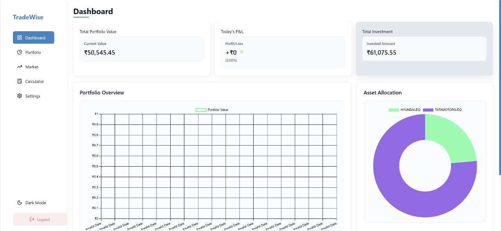
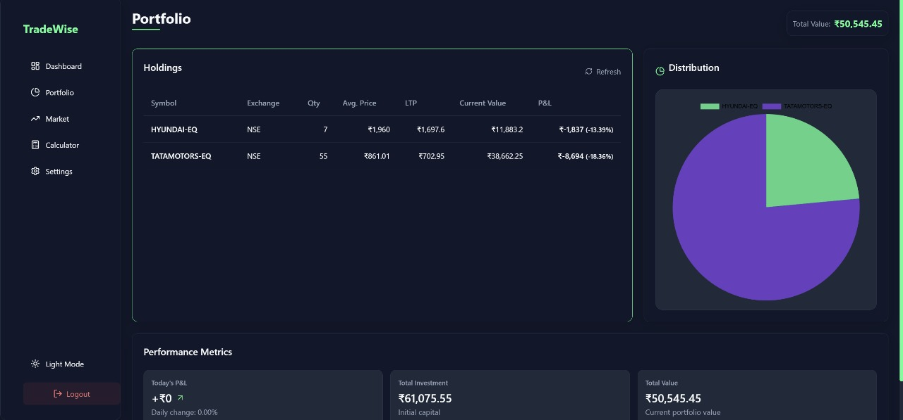
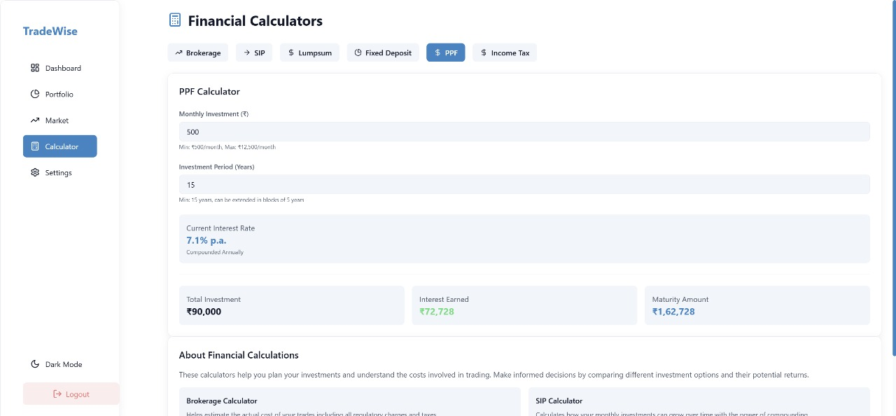
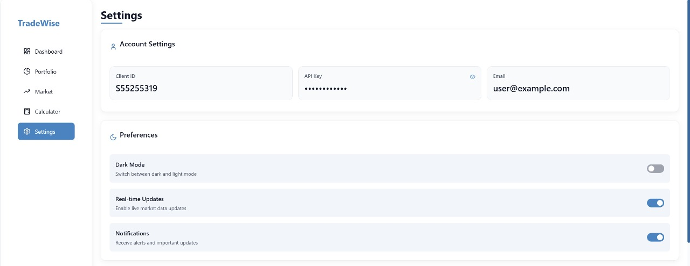
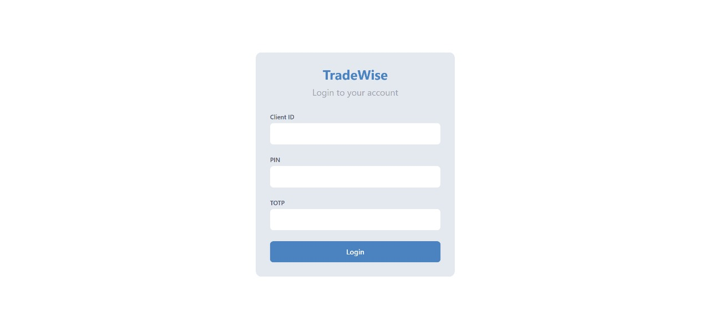

## Code Cartel

# 🚀 AI-Powered Financial Advisory Dashboard

## **📌 Project Overview**
This project is an **AI-driven investment dashboard** that allows users to:
✅ Get **personalized financial advice** using **LLAMA (Groq API)**.  
✅ View **real-time stock market data** from **AngelOne API**.  
✅ **Link their Demat account via Angel One API** to fetch **live stock holdings**.  
✅ **Chat with AI in real time** to ask **financial questions**.  

## **🎨 UI Showcase**
Here's a glimpse of our modern and intuitive user interface:

### Dashboard View

*Main dashboard showing portfolio overview, market trends, and AI insights*

### Portfolio Analysis

*Detailed portfolio analysis with real-time stock tracking (dark theme available)*

### Investment Calculator

*Smart investment calculator for financial planning*

### User Settings

*Customizable user settings and preferences*

### Sign Up Experience

*Streamlined user onboarding process*

---

## **✅ What We Have Completed**
### **1️⃣ Frontend (React Vite + TailwindCSS)**
- **Modern UI Implementation** 🎨 → Created sleek, responsive design with glass-morphism effects.
- **Authentication Pages** 🔐 → Implemented login & signup with Supabase Auth.
- **Dashboard Page** 📊 → Built interactive dashboard with portfolio overview and market trends.
- **Portfolio Analysis** 📈 → Developed detailed portfolio tracking with real-time updates.
- **Investment Calculator** 🧮 → Created tool for financial planning and calculations.
- **Settings Panel** ⚙️ → Implemented user preferences and account management.
- **Interactive Charts** 📈 → Integrated Chart.js for real-time data visualization.
- **Responsive Design** 📱 → Ensured perfect display across all device sizes.

### **2️⃣ Backend (Flask + Supabase)**
- **User Authentication** 👤 → Complete Supabase auth system with email & OAuth.
- **Database Setup** 💾 → Configured Supabase PostgreSQL for user data storage.
- **API Integration** 🔌 → Connected Angel One API for market data.
- **Error Handling** 🛡️ → Implemented robust error management system.
- **Security Measures** 🔒 → Added API key protection and request validation.

---

## **🔜 What We Need to Complete**
### **1️⃣ AI Integration**
- **Groq API Setup** 🤖 → Need to fix API connection and model selection.
- **Portfolio Analysis AI** 📊 → Implement AI-driven investment insights.
- **Real-time Chat** 💬 → Complete the AI chatbot integration.

### **2️⃣ Angel One API Integration**

- **Transaction History** 📜 → Add historical trading data display.

### **3️⃣ Final Touches**
- **Performance Optimization** ⚡ → Improve load times and responsiveness.
- **Testing** 🧪 → Complete end-to-end testing of all features.
- **Documentation** 📝 → Finalize API documentation and setup guides.
- **Deployment** 🚀 → Deploy to production environment.

---

## **📌 Tech Stack**
| **Component**  | **Technology Used**  |
|---------------|----------------------|
| **Frontend**  | React Vite + TailwindCSS + Chart.js |
| **Backend**   | Flask |
| **Database**  | Supabase (PostgreSQL) |
| **Auth System** | Angel One (user login) |
| **AI Model**  | **Groq API (LLAMA-3)** |
| **Stock Data** | Angel One |
| **Brokerage API** | **Angel One API (for portfolio fetching)** |
| **Chatbot System** | Groq API (LLM-based real-time conversation) |
| **Deployment** | Vercel (Frontend) + Render (Backend) |

---

## **📌 Next Steps**
🔹 **Fine-tune chatbot for better user experience**.  
🔹 **Ensure Angel One API integration is fully secure and optimized**.  
🔹 **Deploy and test the system with real users**.  
🔹 **Make final UX improvements before the hackathon ends**.  

🚀 **We're close to finalizing the project! Let's complete these final steps!** 🎯

- Vrajesh Sharma
- Dhruv Mali
- Siddhant Sankesara
- Dhwanish Desai
- Harshil Upadhyay